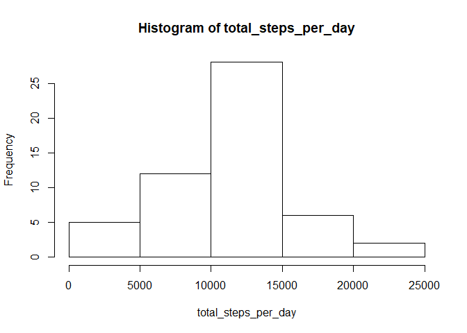
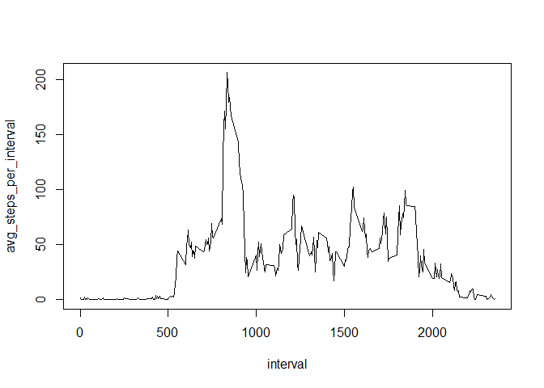
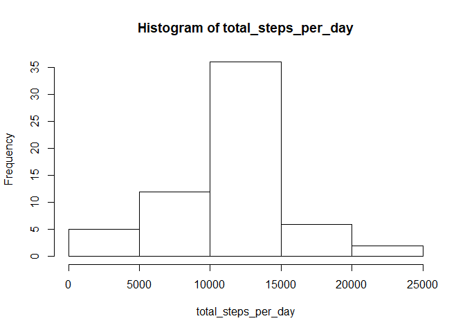
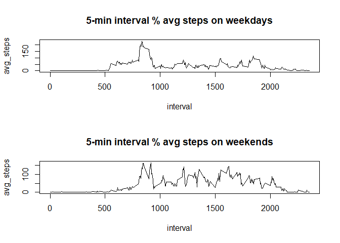

## R Markdown

This is an R Markdown document. Markdown is a simple formatting syntax for authoring HTML, PDF, and MS Word documents. For more details on using R Markdown see <http://rmarkdown.rstudio.com>.

When you click the **Knit** button a document will be generated that includes both content as well as the output of any embedded R code chunks within the document. You can embed an R code chunk like this:


```r
# Loading and preprocessing the data

library(dplyr)
```

```
## Warning: package 'dplyr' was built under R version 3.6.3
```

```
## 
## Attaching package: 'dplyr'
```

```
## The following objects are masked from 'package:stats':
## 
##     filter, lag
```

```
## The following objects are masked from 'package:base':
## 
##     intersect, setdiff, setequal, union
```

```r
library(ggplot2)

temp <- tempfile()
download.file("https://d396qusza40orc.cloudfront.net/repdata%2Fdata%2Factivity.zip", temp)
con <- unz(temp, "activity.csv")

given_data<-read.csv(con)
data_na_rm<-na.omit(given_data) 
```

Question 1.
#What is mean total number of steps taken per day?

Histogram of total steps taken per day.

```r
### What is mean total number of steps taken per day?

grp_data_1 <- data_na_rm %>% group_by(date) %>% summarise(total_steps_per_day = sum(steps))
with(grp_data_1, hist(total_steps_per_day))
```

<!-- -->

mean and median steps taken per day.


```r
mean_steps<-mean(grp_data_1[["total_steps_per_day"]])
median_steps<-median(grp_data_1[["total_steps_per_day"]])
```

Mean steps taken per day are 1.0766189\times 10^{4}
Median steps taken per day are 10765


Question 2.
#What is the average daily activity pattern?

Time series plot of the 5-minute interval and avg steps per interval.

```r
grp_data_2 <- data_na_rm %>% group_by(interval) %>% summarise(avg_steps_per_interval = mean(steps))
with(grp_data_2, plot(interval, avg_steps_per_interval, type = "l"))
```

<!-- -->

The 5-minute interval containing max. avg steps.


```r
max_interval<-grp_data_2[["interval"]][grp_data_2[["avg_steps_per_interval"]]==max(grp_data_2[["avg_steps_per_interval"]])]
```

The 5-minute interval with the max. avg steps is 835


Question 3.
#Imputing missing values etc.

3.1
#Calculate and report the total number of missing values in the dataset


```r
summary(given_data)
```

```
##      steps                date          interval     
##  Min.   :  0.00   2012-10-01:  288   Min.   :   0.0  
##  1st Qu.:  0.00   2012-10-02:  288   1st Qu.: 588.8  
##  Median :  0.00   2012-10-03:  288   Median :1177.5  
##  Mean   : 37.38   2012-10-04:  288   Mean   :1177.5  
##  3rd Qu.: 12.00   2012-10-05:  288   3rd Qu.:1766.2  
##  Max.   :806.00   2012-10-06:  288   Max.   :2355.0  
##  NA's   :2304     (Other)   :15840
```


# Only the variable 'steps' contains NA values. 


```r
total_na_values<-length(which(given_data[["steps"]] %in% NA))
```

The total number of NA values in the steps variable is 2304

3.2

#Devise a strategy for filling in all of the missing values in the dataset. The strategy does not need to be sophisticated. For example, you could use the mean/median for that day, or the mean for that 5-minute interval, etc.

# Strategy for imputation: in place of the NA values, put the mean value of the corresponding 5-min 
# interval. For this, let's first remove all NA values and find out the means of all 5-min intervals.
This is already done in Question 2 so we will just reuse and rename the corresponding variable.


```r
mean_data<-grp_data_2
```

# Now substitute these median values in the corresponding NA values.
# For ex. if the variable "steps" is NA and the value of the corresponding 5-min interval is say 10.
# Then the NA value would be substituted by the median value of "steps" for the 5-min interval "10".


```r
intervals<-mean_data[["interval"]]
substitution_data <- given_data %>% filter(is.na(steps)) %>% rowwise() %>% 
mutate(steps = mean_data[["avg_steps_per_interval"]][which(intervals %in% interval)])

rest_data<-given_data %>% filter(!is.na(steps)) 

total_new_data<-rbind(rest_data, substitution_data)
```

3.3
# Now the histogram of the total number of steps taken each day.


```r
grp_data_3 <- total_new_data %>% group_by(date) %>% summarise(total_steps_per_day = sum(steps))
with(grp_data_3, hist(total_steps_per_day))
```

<!-- -->

# mean & median of total steps per day for the new dataset.


```r
mean_steps_again<-mean(grp_data_3[["total_steps_per_day"]])
median_steps_again<-median(grp_data_3[["total_steps_per_day"]])
```

Mean steps per day for newly imputed dataset are 1.0766189\times 10^{4}
Median steps per day for newly imputed dataset are 1.0766189\times 10^{4}


Question 4.
### Are there differences in activity patterns between weekdays and weekends?
### For this part the weekdays() function may be of some help here. 
### Use the dataset with the filled-in missing values for this part.


```r
total_new_data_new <- total_new_data %>% mutate(day = weekdays(as.Date(date))) %>% 
rowwise() %>% mutate(state = factor(ifelse(day %in% c("Sunday", "Saturday"), "Weekend", "Weekday")))
grp_data_4 <- total_new_data_new %>% group_by(interval, state) %>% summarise(avg_steps = mean(steps))
```

```
## `summarise()` has grouped output by 'interval'. You can override using the
## `.groups` argument.
```

# Panel plot of the 5-min interval & avg steps - for weekdays and weekends.


```r
par(mfrow=c(2,1))
with(subset(grp_data_4, state == "Weekday"), plot(interval, avg_steps, type = "l", main = "5-min interval % avg steps on weekdays"))
with(subset(grp_data_4, state == "Weekend"), plot(interval, avg_steps, type = "l", main = "5-min interval % avg steps on weekends"))
```

<!-- -->
